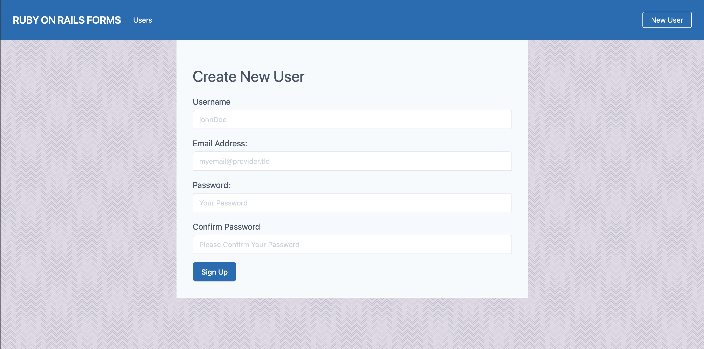

# Re-Former project

In this project, we created the model and web forms using ruby on rails helpers and active records command. This project gave us a chance to build web forms, both using nearly-pure HTML and then helper methods that Rails provide.

## Code execution view:

## Built With

- Ruby on Rails
- VsCode
- Active Records

## Getting Started

To get a local copy up and running follow these simple example steps:

- Clone this repository into your local machine.
- Run the main file by typing this in your command line:

### Validators

- Rubocop
- Stylint

## Authors

👤 **Elias Castañeda**

- Github: [@e71az](https://github.com/e71az)
- Linkedin: [@e71az](https://www.linkedin.com/in/e71az/)
- Twitter: [@e71az](https://twitter.com/e71az)

👤 **Abdulaziz Ali** 
- 
- Github: [@abredi](https://github.com/abredi)
- Twitter: [@rediabdulaziz](https://twitter.com/rediabdulaziz)
- Linkedin: [linkedin](https://www.linkedin.com/in/abdulaziz-ali-98948011a)

## 🤝 Contributing

Contributions, issues and feature requests are welcome!

Feel free to check the [issues page](https://github.com/abredi/re-former/issues).

## Show your support

Give a ⭐️ if you like this project!

## 📝 License

This project is [MIT](lic.url) licensed.
